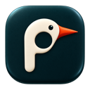

# Peck

**Type clipboard text into places that do not support paste.**

Peck is a native macOS menu-bar utility for remote consoles, disconnected VMs, and other applications where ordinary paste is unavailable. Copy text, focus its destination, and press a shortcut. Peck sends it as keyboard input.

## Install

Requires **macOS 13 or later**. Release builds support Apple silicon and Intel Macs.

1. Download **Peck-adhoc.zip** from the [latest release](https://github.com/zeddy89/Peck/releases/latest).
2. Unzip it and move **Peck.app** to **Applications**.
3. Open Peck and grant **Accessibility** permission. Enable **Input Monitoring** if macOS requests it.

Current releases are **ad-hoc signed with hardened runtime, not notarized**. Follow the [installation guide](docs/install.md) if Gatekeeper blocks opening or permissions need refreshing after an update.

## Use

Copy text with **⌘C**, focus an insertion point, then press **⌃⌥V**. For vi/Vim, enable `:set paste` when supported and enter Insert mode with `i` first.

| Action | Default shortcut |
|---|---|
| Type at the current insertion point | **⌃⌥V** |
| Choose a target with the crosshair | **⌃⌥⌘V** |
| Stop an active run | **Esc** or either Peck shortcut |

Click the bird icon for crosshair targeting; right-click it for the menu. Ordinary **⌘V** is unchanged. Both Peck shortcuts can be configured in Advanced.

Basic Settings offers **Fast (2 ms)**, **Medium (5 ms)**, and **Slow (15 ms)**. Saved speeds are preserved; other values display as Custom. Detailed timing, profiles, calibration, and optional confirmations are in **Advanced**.

Routine paste confirmations are off by default. Newlines can act as Return, so use a scratch editor when transferring scripts. Permission, Secure Input, strict-mapping, and target-change checks remain active where applicable. Speeds and the experimental Vim bracketed-paste profile need testing against your actual console.

## Privacy and delivery

Peck keeps **no clipboard history** and does not log clipboard contents. The app does not use network services. Settings persist locally; exported profiles contain settings and optional user-written notes. Accessibility enables keyboard posting and the local Escape filter.

Peck checks the selected local application/window and stops on detected target changes. It cannot verify browser-tab focus, guest editor mode, or remote receipt, and already-posted input cannot be recalled. See [compatibility and testing](docs/compatibility.md).

## Documentation

Start with the [documentation index](docs/README.md), or go directly to:

- [User guide](docs/guide.md)
- [Troubleshooting](docs/troubleshooting.md)
- [Profiles and calibration](docs/profiles-and-calibration.md)
- [Build and release](docs/development/build-release.md)
- [1.4.0 release notes](docs/releases/1.4.0.md)
- [Verification results](docs/verification.md)

Peck 1.4.0 passed **123 tests**. This verifies modeled behavior and validation logic, not universal remote-console compatibility.
